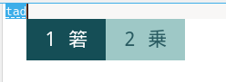
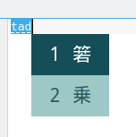
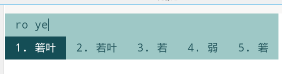
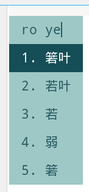

# fcitx5_themes

## 1. 主题说明

### 1.1 名称：箬Leaf 

切换到了 `fcitx5-rime`，于是做了个主题，其实是抄了知乎网友  (@子善)的一个配色。

不过他似乎不喜欢被人打扰吧，链接暂时隐藏了。

由于个人是使用五笔的，对候选框要求不高，所以只是简单的适配了一下拼音(双拼)。

截图仅供参考

### 切换提示


### 五笔横版-非嵌入编码



### 五笔竖版-非嵌入编码



### 双拼横版-嵌入编码



### 双拼竖版-嵌入编码



## 2. 使用

克隆或下载文件到本地：

```console
git clone https://github.com/tankb52/fcitx5_themes.git
```

将想要使用的皮肤文件夹复制到`fcitx5`的主题目录：

```console
// fcitx5 主题目录位置
 ~/.local/share/fcitx5/themes 
```

修改皮肤配置文件(若没有配置文件则自动创建)：

```console
vim ~/.config/fcitx5/conf/classicui.conf
```

将下面的参数复制进去（记得修改字体）：

```apacheconf
# 垂直候选列表
Vertical Candidate List=False

# 按屏幕 DPI 使用
PerScreenDPI=True

# Font (设置成你喜欢的字体)
Font="文泉驿等宽微米黑 14"

# 主题(这里要改成你想要使用的主题名，主题名就在下面)
Theme=箬Leaf
```

其实 `fcitc5` 在 `KDE` 上已经有很好的图形界面配置工具了，只需要拷贝到主题目录下，然后在配置工具中选择一下就可以。