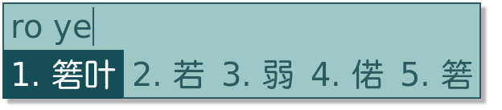
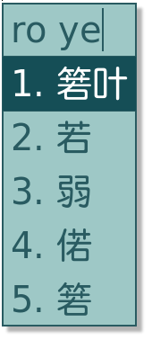
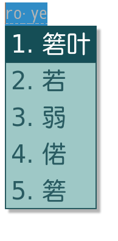
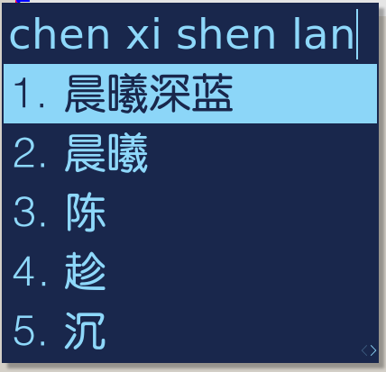
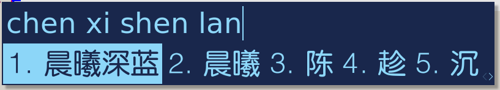
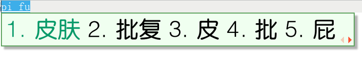
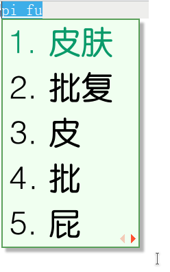
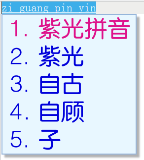
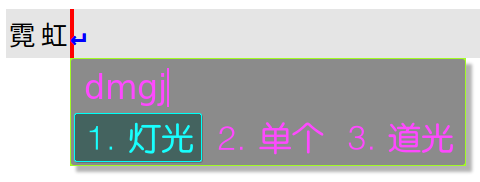
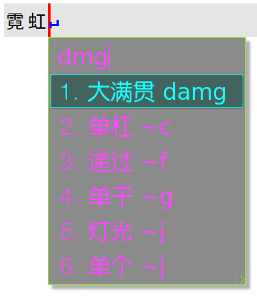

# fcitx5_themes

<<<<<<< HEAD
<<<<<<< HEAD
## 1. 主题说明

### 1.1 名称：箬Leaf 
_ver:0.2_  
更新说明：加入边框线——边框线的值超过 2 后都没什么意义。

切换到了 `fcitx5-rime`，于是做了个主题，其实是抄了知乎网友  (@子善)的一个配色。

不过他似乎不喜欢被人打扰吧，链接暂时隐藏了。

由于个人是使用五笔的，对候选框要求不高，所以只是简单的适配了一下拼音(双拼)。

截图仅供参考

#### 切换提示


#### 双拼横版-非嵌入编码



#### 双拼竖版-非嵌入编码



#### 双拼横版-嵌入编码


#### 双拼竖版-嵌入编码



### 1.2 名称：晨曦·深蓝
偷个懒，不截那么多图了。

其实我用形码 ，横版4个候选项，短短的也很可爱啊😄🤏🏻
#### 横版展示



#### 竖版展示


### 1.3 名称：fcitx3经典版

怀念一下旧版小企鹅输入法

#### 横版展示



#### 竖版展示



### 1.4 名称：紫光拼音
依然怀旧
#### 横版展示


#### 竖版展示


### 1.5 名称：霓虹·灯光
比较适合暗色背景使用的透明皮肤。

#### 横版展示



#### 竖版展示


## 2. 使用

克隆或下载文件到本地：

```console
git clone https://github.com/tankb52/fcitx5_themes.git
```

将想要使用的皮肤文件夹复制到`fcitx5`的主题目录：

```console
// fcitx5 主题目录位置
 ~/.local/share/fcitx5/themes 
```

其实 `fcitc5` 已经有很好的图形界面配置工具`fcitx5-configtool`了，只需要拷贝到主题目录下，然后在配置工具中选择一下就可以。

**有gui配置工具后，下面的操作其实已无意义**  

~~修改皮肤配置文件(若没有配置文件则自动创建)：~~

```console
vim ~/.config/fcitx5/conf/classicui.conf
```

~~将下面的参数复制进去（记得修改字体）：~~

```apacheconf
# 垂直候选列表
Vertical Candidate List=False

# 按屏幕 DPI 使用
PerScreenDPI=True

# Font (设置成你喜欢的字体)
Font="文泉驿等宽微米黑 14"

# 主题(这里要改成你想要使用的主题名，主题名就在下面)
Theme=spring
```